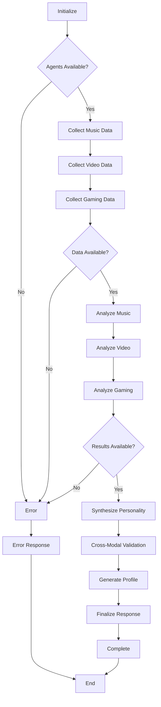

# Bondhu AI - Multi-Agent Personality Analysis System

A sophisticated mental health AI companion that uses multi-agent architecture to analyze user personality through multiple data streams using LangChain and LangGraph.

## 🎯 Project Overview

Bondhu AI is an advanced personality analysis system that leverages the Big Five personality model (OCEAN) to provide comprehensive psychological insights through:

- **Multi-modal data analysis**: Music, video consumption, gaming behavior
- **Cross-validation**: Correlates insights across different data sources
- **Real-time processing**: LangGraph orchestrated workflows
- **Privacy-focused**: User-controlled data collection and storage
- **Extensible architecture**: Easy to add new analysis agents

## 🏗️ System Architecture

```
┌─────────────────┐    ┌─────────────────┐    ┌─────────────────┐
│   Next.js UI    │    │   FastAPI API   │    │   LangGraph     │
│   (Frontend)    │◄──►│   (Backend)     │◄──►│  Orchestrator   │
└─────────────────┘    └─────────────────┘    └─────────────────┘
                              │                       │
                              ▼                       ▼
                    ┌─────────────────┐    ┌─────────────────┐
                    │   Supabase DB   │    │  Agent Network  │
                    │ (Vector Store)  │    │                 │
                    └─────────────────┘    │ ┌─────────────┐ │
                                          │ │Music Agent  │ │
                    ┌─────────────────┐    │ ├─────────────┤ │
                    │  External APIs  │◄──►│ │Video Agent  │ │
                    │ Spotify/YouTube │    │ ├─────────────┤ │
                    │ Steam/OpenAI    │    │ │Gaming Agent │ │
                    └─────────────────┘    │ ├─────────────┤ │
                                          │ │Personality  │ │
                                          │ │   Agent     │ │
                                          └─┴─────────────┴─┘
```

## 🤖 Agent Specifications

### 1. Music Intelligence Agent
- **Purpose**: Analyze Spotify listening patterns for personality insights
- **Data Sources**: Spotify Web API, Last.fm integration
- **Analysis**: Genre mapping, audio feature analysis, listening behavior
- **Personality Correlations**: 
  - Jazz/Classical → High Openness
  - Electronic/Dance → High Extraversion
  - Complex music → High Conscientiousness

### 2. Video Intelligence Agent
- **Purpose**: Process YouTube consumption patterns
- **Data Sources**: YouTube Data API, manual user input
- **Analysis**: Content categorization, viewing habits, engagement patterns
- **Personality Correlations**:
  - Educational content → High Openness + Conscientiousness
  - Entertainment variety → High Extraversion
  - Binge watching → Higher Neuroticism

### 3. Gaming Intelligence Agent
- **Purpose**: Analyze gaming behavior through Steam API and internal games
- **Data Sources**: Steam Web API, Bondhu mini-games, manual input
- **Analysis**: Genre preferences, completion rates, social gaming patterns
- **Personality Correlations**:
  - RPG/Strategy → High Openness + Conscientiousness
  - Multiplayer → High Extraversion + Agreeableness
  - High completion rates → High Conscientiousness

### 4. Personality Analysis Agent
- **Purpose**: Central fusion and cross-modal validation
- **Inputs**: All agent results + survey responses + conversation data
- **Processing**: Big Five trait synthesis with confidence scoring
- **Output**: Comprehensive personality profile with temporal tracking

### 5. LangGraph Orchestrator
- **Purpose**: Coordinate agent workflows and manage state
- **Features**: Error recovery, parallel processing, checkpointing
- **Workflow**: Data collection → Analysis → Cross-validation → Synthesis

## 🛠️ Technical Stack

### Core Technologies
- **Backend**: Python 3.9+, FastAPI, Uvicorn
- **AI Framework**: LangChain, LangGraph, LangSmith
- **Database**: Supabase (PostgreSQL + Vector Store)
- **LLMs**: OpenAI GPT-4, Anthropic Claude (optional)

### External Integrations
- **Music**: Spotify Web API with OAuth2
- **Video**: YouTube Data API v3
- **Gaming**: Steam Web API
- **Authentication**: Supabase Auth

### Development Tools
- **API Documentation**: FastAPI auto-generated docs
- **Logging**: Python logging with structured output
- **Testing**: pytest, asyncio testing
- **Type Safety**: Pydantic models, Python type hints

## 🚀 Quick Start Guide

### Prerequisites
```bash
# Python 3.9 or higher
python --version

# Git for cloning
git --version
```

### Installation

1. **Clone the repository**:
```bash
git clone <repository-url>
cd bondhu-ai
```

2. **Create virtual environment**:
```bash
python -m venv venv

# Windows
venv\Scripts\activate

# macOS/Linux
source venv/bin/activate
```

3. **Install dependencies**:
```bash
pip install -r requirements.txt
```

4. **Environment setup**:
```bash
# Copy environment template
cp .env.example .env

# Edit .env with your API keys
# Required: OPENAI_API_KEY, SUPABASE_URL, SUPABASE_KEY
# Optional: SPOTIFY_CLIENT_ID, YOUTUBE_API_KEY, STEAM_API_KEY
```

5. **Run the application**:
```bash
python main.py
```

The API will be available at `http://localhost:8000` with automatic documentation at `http://localhost:8000/docs`.

## 📋 API Documentation

### Core Endpoints

#### Personality Analysis
```http
POST /api/v1/personality/analyze
Content-Type: application/json

{
  "user_id": "user123",
  "requested_agents": ["music", "video", "gaming"],
  "force_refresh": false,
  "include_cross_modal": true
}
```

#### Get Personality Profile
```http
GET /api/v1/personality/{user_id}
```

#### Agent Status Check
```http
GET /api/v1/agents/status
```

#### Spotify Integration
```http
GET /api/v1/agents/music/connect?user_id=user123
```

### Response Formats

#### Personality Profile Response
```json
{
  "user_id": "user123",
  "scores": {
    "openness": {
      "trait": "openness",
      "score": 75.5,
      "confidence": 0.82,
      "confidence_level": "high",
      "data_points": 15
    }
  },
  "overall_confidence": 0.78,
  "data_sources": ["music", "video", "gaming"],
  "created_at": "2024-01-01T12:00:00Z"
}
```

## 🧠 Personality Model

### Big Five Traits (OCEAN Model)

1. **Openness to Experience** (0-100)
   - Creativity, curiosity, intellectual interests
   - High: Artistic, imaginative, prefers variety
   - Low: Practical, conventional, prefers routine

2. **Conscientiousness** (0-100)
   - Organization, persistence, goal-orientation
   - High: Disciplined, achievement-oriented, reliable
   - Low: Spontaneous, flexible, carefree

3. **Extraversion** (0-100)
   - Sociability, energy, positive emotions
   - High: Outgoing, talkative, seeks stimulation
   - Low: Reserved, independent, prefers solitude

4. **Agreeableness** (0-100)
   - Cooperation, trust, empathy
   - High: Compassionate, trusting, helpful
   - Low: Competitive, skeptical, challenging

5. **Neuroticism** (0-100)
   - Emotional instability, anxiety, negative emotions
   - High: Anxious, moody, emotionally reactive
   - Low: Calm, resilient, emotionally stable

### Confidence Scoring
- **High Confidence** (0.7-1.0): Strong data support, cross-validated
- **Medium Confidence** (0.4-0.7): Moderate data, some validation
- **Low Confidence** (0.0-0.4): Limited data, requires more input

## 🔧 Configuration Guide

### Environment Variables

#### Required Configuration
```env
# Core API Keys
OPENAI_API_KEY=sk-...                    # OpenAI API access
SUPABASE_URL=https://...                 # Supabase project URL
SUPABASE_KEY=eyJ...                      # Supabase anon key

# Security
SECRET_KEY=your-secret-key               # JWT signing key
```

#### Optional Integrations
```env
# Spotify Integration
SPOTIFY_CLIENT_ID=your-client-id
SPOTIFY_CLIENT_SECRET=your-client-secret

# YouTube Integration  
YOUTUBE_API_KEY=your-youtube-key

# Steam Integration
STEAM_API_KEY=your-steam-key

# Anthropic (Optional)
ANTHROPIC_API_KEY=sk-ant-...
```

#### Performance Tuning
```env
# Agent Configuration
AGENT_TIMEOUT=30                         # Agent timeout in seconds
AGENT_MAX_RETRIES=3                      # Max retry attempts
CONCURRENT_AGENTS=3                      # Parallel agent limit

# Rate Limiting
SPOTIFY_RPM=100                          # Spotify requests per minute
YOUTUBE_RPM=100                          # YouTube requests per minute
OPENAI_RPM=3000                          # OpenAI requests per minute
```

### API Key Setup

#### Spotify Web API
1. Go to [Spotify Developer Dashboard](https://developer.spotify.com/)
2. Create new app with redirect URI: `http://localhost:8000/api/v1/auth/spotify/callback`
3. Copy Client ID and Client Secret to `.env`

#### YouTube Data API
1. Go to [Google Cloud Console](https://console.cloud.google.com/)
2. Enable YouTube Data API v3
3. Create API key and copy to `.env`

#### Steam Web API
1. Go to [Steam Web API Key](https://steamcommunity.com/dev/apikey)
2. Register for API key
3. Copy key to `.env`

## 🔄 Workflow Architecture

### LangGraph State Flow



### Error Recovery
- **Graceful degradation**: Continue with available data if some agents fail
- **Retry logic**: Automatic retry with exponential backoff
- **Partial results**: Return insights from successful agents
- **Status tracking**: Real-time workflow status monitoring

## 🧪 Testing Guide

### Running Tests
```bash
# Install test dependencies
pip install pytest pytest-asyncio pytest-cov

# Run all tests
pytest

# Run with coverage
pytest --cov=. --cov-report=html

# Run specific test categories
pytest tests/test_agents.py
pytest tests/test_orchestrator.py
```

### Test Categories

#### Unit Tests
- Individual agent functionality
- Data model validation
- Configuration management
- Utility functions

#### Integration Tests
- Agent-to-agent communication
- API endpoint functionality
- Database operations
- External API mocking

#### End-to-End Tests
- Complete analysis workflows
- Error recovery scenarios
- Performance benchmarks
- Frontend integration

### Mock Data for Testing
```python
# Example test data structure
test_music_data = {
    "top_tracks": [...],
    "audio_features": {...},
    "genre_analysis": {...}
}
```

## 🚀 Deployment Guide

### Local Development
```bash
# Development server with auto-reload
python main.py

# Or with uvicorn directly
uvicorn main:app --reload --host 0.0.0.0 --port 8000
```

### Production Deployment

#### Docker Deployment
```dockerfile
FROM python:3.9-slim

WORKDIR /app
COPY requirements.txt .
RUN pip install -r requirements.txt

COPY . .
EXPOSE 8000

CMD ["uvicorn", "main:app", "--host", "0.0.0.0", "--port", "8000"]
```

#### Environment Setup
```bash
# Production environment variables
export ENVIRONMENT=production
export API_DEBUG=false
export LOG_LEVEL=INFO
```

### Scaling Considerations
- **Database**: Use connection pooling and read replicas
- **API**: Deploy with ASGI server (Gunicorn + Uvicorn)
- **Caching**: Implement Redis for agent results
- **Monitoring**: Add application performance monitoring

## 🔐 Security & Privacy

### Data Privacy
- **User consent**: Explicit opt-in for all data collection
- **Data minimization**: Collect only necessary personality-relevant data
- **Retention policies**: Automatic data expiration and cleanup
- **Anonymization**: Remove PII from analysis datasets

### API Security
- **Authentication**: JWT tokens for user sessions
- **Rate limiting**: Prevent API abuse and DoS attacks
- **Input validation**: Pydantic models for all inputs
- **CORS**: Restricted to authorized frontend domains

### External API Safety
- **Token encryption**: Secure storage of OAuth tokens
- **Scope limitation**: Minimal required permissions
- **Rotation**: Regular token refresh and validation
- **Monitoring**: Track API usage and anomalies

## 🤝 Contributing

### Development Setup
1. Fork the repository
2. Create feature branch: `git checkout -b feature/new-agent`
3. Follow coding standards (Black, isort, mypy)
4. Add tests for new functionality
5. Update documentation
6. Submit pull request

### Code Standards
```bash
# Format code
black .
isort .

# Type checking
mypy .

# Linting
flake8 .
```

### Adding New Agents
1. Inherit from `BaseAgent` class
2. Implement required abstract methods
3. Add personality trait mappings
4. Include comprehensive tests
5. Update orchestrator workflow
6. Document agent capabilities

## 📊 Performance Metrics

### Benchmarks
- **Analysis time**: ~15-30 seconds for complete profile
- **API response**: <2 seconds for cached results
- **Memory usage**: ~200MB per active user session
- **Throughput**: 100+ concurrent analyses

### Monitoring
- **Health checks**: System component status
- **Performance tracking**: Response times and errors
- **Usage analytics**: Agent utilization and success rates
- **Quality metrics**: Cross-modal consistency scores

## 📞 Support & Documentation

### Additional Resources
- **API Documentation**: [http://localhost:8000/docs](http://localhost:8000/docs)
- **LangGraph Guide**: [LangGraph Documentation](https://langchain-ai.github.io/langgraph/)
- **Personality Research**: Big Five model scientific papers
- **Frontend Integration**: Next.js setup guide

### Common Issues

#### Agent Initialization Errors
```bash
# Check API keys are set
python -c "from core.config import get_config; print(get_config().openai.api_key[:10])"

# Verify Spotify credentials
python -c "from agents.music import MusicIntelligenceAgent; agent = MusicIntelligenceAgent('test')"
```

#### Database Connection Issues
```bash
# Test Supabase connection
python -c "from core.config import get_config; print(get_config().database.url)"
```

### Getting Help
- **Issues**: GitHub Issues for bug reports
- **Discussions**: GitHub Discussions for questions
- **Documentation**: In-code docstrings and comments
- **Examples**: `/examples` directory for usage patterns

---

## 📄 License

MIT License - see LICENSE file for details.

## 🙏 Acknowledgments

- **OpenAI**: GPT-4 language model
- **LangChain**: Agent framework and orchestration
- **Spotify**: Music data and API access
- **Big Five Research**: Personality psychology foundation
- **Open Source Community**: Dependencies and tools

---

*Built with ❤️ for mental health awareness and personality understanding*